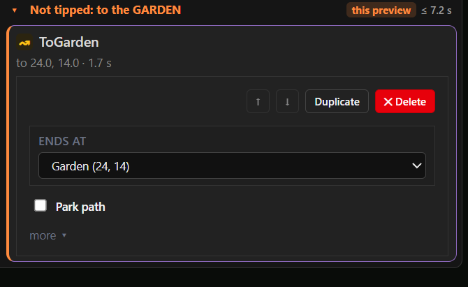
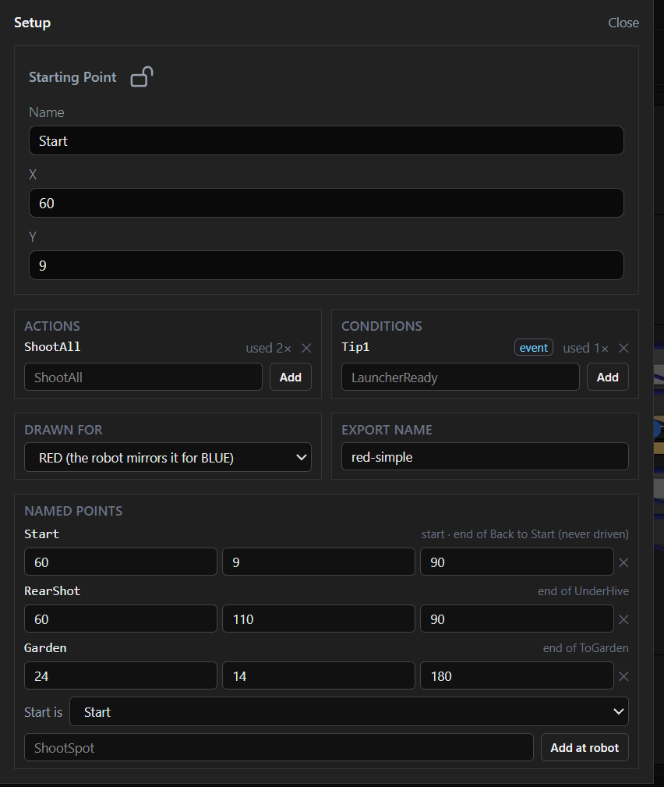

# Design brief: an Auto builder for FTC robots

For a fresh design pass (Claude Design). What exists today works; it is still too busy and not
obvious enough. This brief says what the tool is for, what an Auto is, what we learned building the
current version, and what we would like explored. Think big: the current layout is a starting
point, not a constraint.

## The problem to solve first: branching

The part of the tool that matters most, and works worst, is **building the reacting part of an
Auto**: decisions, waits and what happens in each branch. Today it is a form, and it is unusable:

What is wrong with it, concretely:

- It shows the **engine, not the intent**. Internally a decision is "the first of these rows to
  become true", and each row has a type (condition, time passed, time left, otherwise, near a
  point, in an area). The editor shows exactly that: "Row 1", "Row 2", "Becomes true when",
  "Condition is true", "Time passed (ms)", "+ Condition row / + Time row / + Otherwise", arrows to
  reorder rows. None of these words are how a person thinks about "did the HIVE tip?".
- The same thing is said three times: the question ("Did our HIVE tip?"), the row's condition
  (Tip1) and the branch name ("Tipped: under the HIVE").
- Units and bookkeeping are in the way: 3000 *milliseconds*, "2 cards · add here", "Worst case
  with this branch: the Auto ends by 10.3 s" on every row.
- The branch's steps are not here at all; they are further down the list. Editing the decision
  and editing what happens after it are two different places.

**What people actually want to say.** The mentor interview (below) settled it: **there is one
branching block.** Every branch in this year's Autos is

> **Wait for a trigger, at most N s.** Triggered → one route. Timed out → another route.

A plain wait ("wait for IntakeFull, at most 1.5 s, then carry on") is the same block with both
exits carrying on the same way. Routes may **rejoin** afterwards or run to the end of the Auto.
The one other kind of branch, "not enough time left: go park", is **automatic**: the tool works out
when the rest of the plan and the park path no longer fit, and the team only marks which path is
the park path. Anything else the engine can do (several triggers racing, "near a point", "in an
area") is rare; it can be hard to reach and must not shape the screen.

**What already works, and should drive the design:** the preview switches. Each condition the
robot offers is a chip at the top (✓ Tipped · ✗ IntakeFull). Clicking one is like answering the
robot's question for it, and the Auto instantly follows the other branch on the field. People
understood that at once. Building a decision should feel as direct as answering one: pick the
question (a chip), say how long to wait, and draw or pick what happens in each case.

**What we would like from design here:** a way to create and edit that one block that reads like
the sentence above, shows both routes and their steps together, and can be done largely on the
field (the robot is at the spot where it waits; each route leaves that spot). Adding a route, or
steps to one, or rejoining two routes, should be one gesture, not a form.

## How this year's Autos go (BIOBUZZ)

The tool is for this season's game first; generality can come later. From the interview, the
Autos we expect all look like this:

1. **Start on the GARDEN side and launch all preloads** (always first).
2. **Did the HIVE tip?** Wait for the HIVE to **leave its start position** (it is GARDEN_UP at the
   start; tipping passes through TRANSITION to LOADING_UP, and either counts), at most N s.
   - **Tipped:** go on to the next part, typically the LOADING side.
   - **Timed out:** collect the GARDEN pollen, launch again to force the tip, and **check again**:
     tipped → **rejoin** the main plan; still not → usually **park** (decided per Auto).
3. **Collect until full.** At a FLOWER (often the LOADING-side one): take pollen until
   **IntakeFull**, at most N s, then drive to the next shooting spot and launch.
4. **Did it tip back?** After launching at the LOADING CELL, wait for the HIVE to leave
   LOADING_UP, at most N s, and branch the same way.
5. **Bail out to park** whenever the rest will not fit in 30 s (automatic, see above).

Early in the season the robot stops to aim, launches, then moves again: no shooting on the move and
no reacting mid-path. The intake stops itself at 4 pieces (its own state machine), so the Auto only
waits for IntakeFull; it does not manage the intake.

## What it is for

FTC robots run a 30-second **Autonomous** period ("Auto") at the start of each match, with no
driver input. A good Auto is not a fixed script: it reacts. "Shoot, then if the HIVE tipped drive
under it and shoot again; if not, go to the GARDEN." Today teams write that in Java by hand, and
most students cannot read or change it.

The tool lets a team **draw** a reacting Auto on the field, **preview** every way it can play out
against the 30 s budget, and **export** Java the robot runs as is. It is built by a mentor for our
team and will be given to the FTC community.

**Who uses it:** high-school students and mentors, on a laptop, in a workshop or in the pits
between matches. At an event the typical job is small and urgent: "move the shooting spot 2 in
back", "skip the second pickup", "does this still fit in 30 s?"

## What an Auto is (the model to design for)

An Auto is a sequence of three kinds of step, and they must **look different** at a glance: the
interview's main complaint about the current list is that a command, a path and a branch point all
look alike.

| Step | Example | What it shows |
|---|---|---|
| **Command** | LaunchAll, IntakeOn | A name the robot code registers (a command in the robot's command framework). It ends on its own (LaunchAll: when the pieces are gone) or at its **timeout**, which is worth showing. |
| **Path** | Drive to RearShot | A curve on the field from wherever the robot is, ending on a named spot or a spot of its own. |
| **Wait for trigger** | HIVE left start, at most 3 s | The one branching block: triggered → one route, timed out → another. Routes can rejoin. |

Plus one marker: a route's **park path**, which the automatic bailout drives when time runs short.

**Triggers are short true/false names** the robot code registers (`Tipped`, `IntakeFull`). The
preview does not simulate *when* a trigger fires: each is a switch, **✓ happens** (fires the moment
it is waited for) or **✗ never happens** (the wait times out). ✓ everywhere is the fastest the Auto
can go, ✗ everywhere the slowest; a real match falls between. The HIVE triggers describe what the camera sees now,
so it does not matter when they are asked: `HiveLeftGarden` (the HIVE is mid-tip or settled
LOADING_UP; used after launching at the GARDEN CELL) and `HiveLeftLoading` (the tip back). A tip
that happens during the launch is already true when the wait begins.

**Named spots** (RearShot, Park, Garden) are places the robot does something. Path ends pinned to
a spot move with it: change RearShot and every path that ends there follows. They are also what a
team changes at an event, and the names the Java uses.

**The field** is 141.5 in square. The Auto is drawn for one alliance (red) and mirrored for the
other. The robot must start touching a wall, must not cross the center line during Auto, and ends
the Auto parked in its LOADING ZONE for points.

**Positions are typed as often as dragged.** Coordinates are inches with **one decimal** at most
(23.1, never 23.5353). Later in a season teams type points in rather than drag them, for
consistency, so exact entry of x / y / heading must be easy wherever a point is, and dragging must
snap to tenths.

## Decisions from the mentor interview

- **Words:** *command* (not action), *path*, *trigger*, *wait for trigger … at most N s*.
- **One branching block** plus the automatic park bailout (above). Routes may rejoin.
- **Visual language:** commands, paths and triggers must be distinguishable by shape and color,
  not only by an icon; a command shows its timeout.
- **Built for BIOBUZZ this season.** Name things in the game's terms (HIVE, CELL, FLOWER,
  GARDEN, LOADING); do not generalize at the cost of clarity.
- **Exact positions** matter more as the season goes on: one decimal, typed entry, snapping.
- **The original Pedro Visualizer** is linked for pure path tuning (same file), but this tool is
  not bound to its layout or tools.
- **Top-bar tools:** the ruler and protractor are light and fine; the inches, magnet/snap and
  other unlabeled tools are unclear and should earn their place or go.
- **Deferred:** reacting mid-path and shooting on the move (later in the season, if at all); what
  a failed retry does beyond parking (needs testing).

## The canonical example

Use this to test every concept (it is `samples/red-simple.pp`, live at
<https://mona-shores-ftc-robotics.github.io/Visualizer/#sample=red-simple>):

1. Start touching the audience wall at (60, 9), facing the HIVE.
2. LaunchAll.
3. Decision "Did our HIVE tip?", waiting up to 3 s:
   - **Tipped** → drive straight under the HIVE to RearShot (60, 110), LaunchAll.
   - **else** → curve over to Garden (24, 14), turning to face the red wall.

A bigger one with collection passes, a FLOWER pickup and parking is `samples/red-garden-basic.pp`.

## What we learned (keep these)

- **One screen.** A separate "paths" view that plays every path in a row, ignoring branches,
  was nonsense next to the Auto. Everything lives in one view of the whole Auto.
- **No hand-holding.** Paragraphs explaining what a card does were noise; nobody read them. If a
  screen needs explaining, the screen is wrong. Tooltips at most.
- **Show less by default.** A path step needs "ends at" and "park" nearly every time; which path,
  actions while driving and events along the path are rare and belong behind "more".
- **The preview is a few switches**, one per trigger (✓ Tipped · ✗ IntakeFull), not a form of
  timings or a question per step.
- **Adding a path means "from here".** Select RearShot, add a path, and it starts at RearShot, at
  the end of that branch. Anything else surprised people.
- **Branches must read as branches** on the field too: the previewed one solid, the other
  dashed, the spot where the decision waits marked.
- **The running step lights up** as the preview plays. That replaced a text log.

## What still hurts

- **Step types are not recognisable.** A path step is marked only by a small "↝" glyph; the mentor
  could not tell it was a path. Commands, paths and waits need distinct shapes and colors.

  

- **Setup is a grab bag.** One dialog mixes the start pose (which is also the named point
  "Start", shown twice), the robot's registered commands and triggers, the alliance, the export
  name and the named points, with placeholder text (ShootAll, LauncherReady, ShootSpot) that reads
  like data, bookkeeping ("used 2×"), a lock icon, and "Start is" / "Add at robot" controls that
  need explaining. The start pose has no heading field while the named points do.

  

  What it has to hold: the start pose (a named spot like any other, touching a wall); the list of
  commands and triggers the robot code registers (ideally read from the robot code, not typed);
  the alliance the Auto is drawn for; the export name; and the named spots. Most of it is set once
  per season; the named spots are edited all the time and probably belong on the field.

- Building decisions (above).
- The step list and the field are two separate pictures of the same Auto. Your eye goes back and
  forth to connect "UnderHive" in the list with the green line on the field.
- Decisions are hard to see on the field: where the robot waits, and where each branch goes.
- Drawing paths still uses old tools (add control point, remove control point); curves are fiddly.
- Named spots, the robot's list of actions and conditions, the start pose and the export are
  necessary but rarely touched, and still take attention.
- Nothing shows time *on the field*: which parts of the Auto are slow, where the 30 s runs out.

## Ideas worth exploring

Not requirements; directions we have not tried.

- **Field-first authoring.** Build the Auto by acting on the field: click the robot, "drive here",
  "shoot here", "if tipped go here, else there". The list becomes a summary, or disappears.
- **Branches as forks on the field**, with the decision drawn where the robot waits and its
  conditions as labels on each fork. Switching ✓/✗ on the fork itself.
- **A timeline** along the bottom: one lane per branch, steps as blocks sized by time, the 30 s
  line as a hard edge. Scrub it and the robot moves.
- **A storyboard** of the match: a few frames ("0 s shoot", "3 s decide", "8 s at RearShot") that
  read like a coach's whiteboard.
- **Compare outcomes** side by side: tipped vs not tipped, each with its time.
- **Event mode**: a stripped-down view for the pits, showing just the named spots and the times,
  for quick nudges.
- **Touch and projector friendly**: large targets, readable across a table.

## What the original Pedro Visualizer does (don't lose it)

This tool began as a fork of the [Pedro Pathing Visualizer](https://github.com/Pedro-Pathing/Visualizer),
a path editor teams already know. Our Auto screen hid or dropped much of it, sometimes too quickly:
its right-hand panel was cluttered, but it held the precise editing a team needs later in the
season. The new design should keep these capabilities, reframed, even if most stay out of sight
until needed. (Upstream stays available for pure path work; we are not bound to its layout.)

**Editing a path precisely** (the old right-hand inspector):
- Select a path, then a point on it (end point, control point 1, 2, …) and **type its x / y**.
  Lock a point so it cannot be dragged by accident. Delete a control point.
- **Heading along a path**, which is how the robot turns while it drives: constant (one angle),
  linear (from one angle to another), tangential (face the direction of travel, optionally
  reversed), or **piecewise** (a timeline along the path split into segments, each linear,
  constant, tangential or "face a point on the field").
- A **wait after a path** (ms), a path's name, and deleting a path.
- The **start pose**: name, x, y, heading, and a lock.
- The robot's **position and heading** at the current moment of playback.
- **Groups** of paths that the robot follows as one smooth motion, with one heading rule for the
  whole group.

**Drawing on the field**
- Drag end points and control points; add a path by double-clicking the field; add or remove a
  control point (the curve's shape); a pen tool that turns a freehand stroke into paths.
- **Grid** (1, 3, 6, 12 in) with **snap to grid**; a **ruler** with draggable ends; a
  **protractor** that can follow the robot. The coordinate picker copies "x, y" from a click.
- Keyboard: W add path, A / S add / remove control point, Space or K play, Delete, Cmd+Z / Cmd+S.

**Seeing and comparing**
- Play the whole motion with a scrubber and markers; the robot drawn at its real size, with a
  heading arrow and optional "onion skin" copies along the path.
- **Overlay up to four other saved files** (for example our partner's Auto, or a second version
  of ours) on the same field.

**Robot and timing settings** (they change every time the preview shows): robot width, height
and safety margin; maximum velocity, acceleration and deceleration, turning speed, friction.
The field image (including a custom one).

**Files and export**: a file manager in the browser (new, rename, duplicate, **duplicate and
mirror** for the other alliance), save and save-as, load from disk, a share link, export as Java
or Kotlin path code (optionally mirrored), as a PNG of the field, or as an animated GIF.

**Where these fit in the new design** is open. Our guess: exact x / y / heading entry, locking,
heading along a path and curve shape belong to "select a path or spot, then edit it right there"
(a popover or a slide-in inspector that is gone when nothing is selected); robot and timing
settings, the field image and files belong in a settings / file area visited rarely; the grid,
snap, ruler and protractor are light view tools worth keeping; overlaying a partner's Auto is
worth keeping for BIOBUZZ, where two robots share one side of the field.

## Hard constraints

- It saves the same file format (`.pp`, documented in `docs/auto-format.md`) and exports the same
  Java, so the robot side does not change. The format can grow; it must stay readable by
  the current editor or be migrated.
- Runs in a browser, offline once loaded, on school laptops. Dark theme today; not required.
- The field image and its coordinates are fixed (Pedro Pathing's frame: origin at a corner,
  inches, angles counter-clockwise).

## What we would like back

1. Two or three **distinct concepts** for the whole screen, not variations of the current one.
2. For the strongest concept, the key flows as screens:
   - build the canonical example from an empty field;
   - turn a plain "launch, drive" Auto into "wait for Tipped, at most 3 s: … / timed out: …";
   - the retry: timed out → collect GARDEN pollen, launch, wait for Tipped again → rejoin the
     main plan, or park;
   - "collect at the LOADING FLOWER until IntakeFull, at most 2 s", then drive and launch;
   - add the "else" branch to an existing decision;
   - add a wait ("IntakeFull, at most 1.5 s") inside a branch;
   - preview tipped vs not tipped and see the time of each;
   - at an event, move RearShot 2 in back and check it still fits in 30 s;
   - export.
3. A short note on what each concept drops or hides, and why.

The current tool, for reference: <https://mona-shores-ftc-robotics.github.io/Visualizer/>
(open a sample from `#sample=red-simple` or `#sample=red-garden-basic`).
