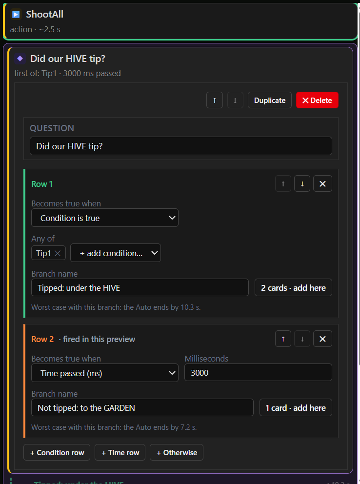
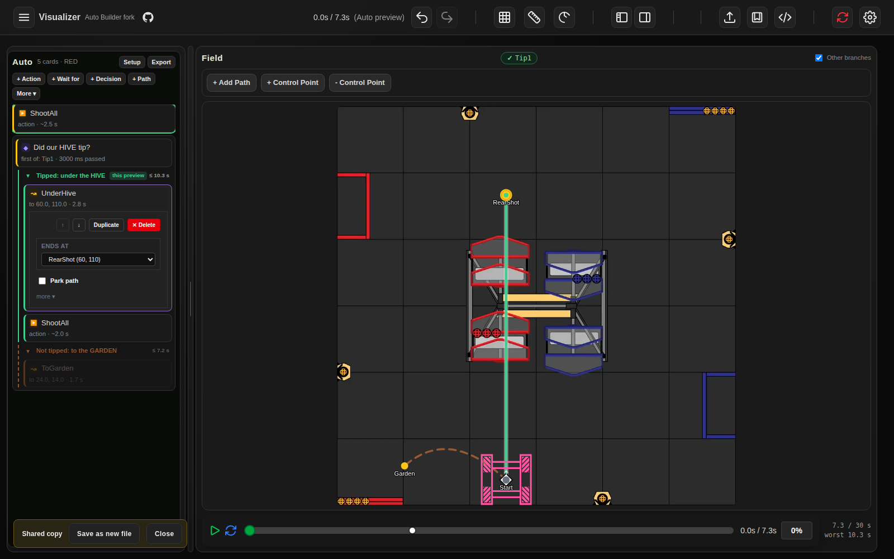

# Design brief: an Auto builder for FTC robots

For a fresh design pass (Claude Design). What exists today works; it is still too busy and not
obvious enough. This brief says what the tool is for, what an Auto is, what we learned building the
current version, and what we would like explored. Think big: the current layout is a starting
point, not a constraint.

## The problem to solve first: branching

The part of the tool that matters most, and works worst, is **building the reacting part of an
Auto**: decisions, waits and what happens in each branch. Today it is a form, and it is unusable:

What is wrong with it, concretely:

- It shows the **engine, not the intent**. Internally a decision is "the first of these rows to
  become true", and each row has a type (condition, time passed, time left, otherwise, near a
  point, in an area). The editor shows exactly that: "Row 1", "Row 2", "Becomes true when",
  "Condition is true", "Time passed (ms)", "+ Condition row / + Time row / + Otherwise", arrows to
  reorder rows. None of these words are how a person thinks about "did the HIVE tip?".
- The same thing is said three times: the question ("Did our HIVE tip?"), the row's condition
  (Tip1) and the branch name ("Tipped: under the HIVE").
- Units and bookkeeping are in the way: 3000 *milliseconds*, "2 cards · add here", "Worst case
  with this branch: the Auto ends by 10.3 s" on every row.
- The branch's steps are not here at all; they are further down the list. Editing the decision
  and editing what happens after it are two different places.

**What people actually want to say.** Almost every decision in an FTC Auto is one of these:

1. **If X happens within N s, do A; otherwise do B.** ("If Tip1 within 3 s, go under the HIVE,
   else go to the GARDEN.") This is by far the most common.
2. **Wait until X, at most N s**, then carry on. ("Wait for IntakeFull, at most 1.5 s.") A
   decision with one branch that does nothing.
3. **If X or Y**, occasionally ("Tip1 or CameraBlind").
4. **If time is running out, park** (the endgame guard, once per Auto, mostly automatic).

The other row types (several time rows, "time left below", "near a point", "in an area") exist in
the engine and are rare. They can be hard to reach; they must not shape the common case.

**What already works, and should drive the design:** the preview switches. Each condition the
robot offers is a chip at the top (✓ Tip1 · ✗ IntakeFull). Clicking one is like answering the
robot's question for it, and the Auto instantly follows the other branch on the field. People
understood that at once. Building a decision should feel as direct as answering one: pick the
question (a chip), say how long to wait, and draw or pick what happens in each case.

**What we would like from design here:** a way to create and edit a decision that reads like
sentence 1 above, shows its branches and their steps together, and can be done largely on the
field (the robot is at the spot where it waits; each branch is a route leaving that spot).
Adding a branch, or steps to one, should be one gesture, not a form.

## What it is for

FTC robots run a 30-second **Autonomous** period ("Auto") at the start of each match, with no
driver input. A good Auto is not a fixed script: it reacts. "Shoot, then if the HIVE tipped drive
under it and shoot again; if not, go to the GARDEN." Today teams write that in Java by hand, and
most students cannot read or change it.

The tool lets a team **draw** a reacting Auto on the field, **preview** every way it can play out
against the 30 s budget, and **export** Java the robot runs as is. It is built by a mentor for our
team and will be given to the FTC community.

**Who uses it:** high-school students and mentors, on a laptop, in a workshop or in the pits
between matches. At an event the typical job is small and urgent: "move the shooting spot 2 in
back", "skip the second pickup", "does this still fit in 30 s?"

## What an Auto is (the model to design for)

An Auto is a list of steps run top to bottom. Five kinds matter; the rest are rare.

| Step | Example | Notes |
|---|---|---|
| **Action** | ShootAll, IntakeOn | A name the robot code offers. |
| **Path** | Drive to RearShot | A curve on the field from wherever the robot is. Ends on a named spot or a spot of its own. |
| **Wait** | Wait for IntakeFull, at most 1.5 s | Always has a time limit, so the robot never freezes. |
| **Decision** | Did the HIVE tip? Tip1 → A, else after 3 s → B | Waits for the first of its conditions; each has its own branch of steps. The steps after the decision continue from wherever the branch left the robot. |
| **Park** | The branch's last path, marked | If time runs short, the robot abandons what it is doing and drives it. |

**Conditions are true/false names** the robot code offers, of two kinds:
- **Events** stay true once they happen: `Tip1` (the HIVE's first tip), `Tip2`.
- **States** can change back: `IntakeFull` (holding 4 pieces right now).

The only number a condition needs is the wait's time limit. The preview does not simulate *when*
something happens: each condition is either **✓ happens** (fires the moment it is asked) or
**✗ never happens** (the wait runs out). ✓ everywhere is the fastest the Auto can go, ✗ everywhere
the slowest; a real match falls between.

**Named spots** (RearShot, Park, Garden) are places the robot does something. Path ends pinned to
a spot move with it: change RearShot and every path that ends there follows. They are also what a
team changes at an event, and the names the Java uses.

**The field** is 141.5 in square. The Auto is drawn for one alliance (red) and mirrored for the
other. The robot must start touching a wall, must not cross the center line during Auto, and ends
the Auto parked in its LOADING ZONE for points. Coordinates are in inches with at most one
decimal.

## The canonical example

Use this to test every concept (it is `samples/red-simple.pp`, live at
<https://mona-shores-ftc-robotics.github.io/Visualizer/#sample=red-simple>):

1. Start touching the audience wall at (60, 9), facing the HIVE.
2. ShootAll.
3. Decision "Did our HIVE tip?", waiting up to 3 s:
   - **Tip1** → drive straight under the HIVE to RearShot (60, 110), ShootAll.
   - **else** → curve over to Garden (24, 14), turning to face the red wall.

A bigger one with collection passes, a FLOWER pickup and parking is `samples/red-garden-basic.pp`.

## What we learned (keep these)

- **One screen.** A separate "paths" view that plays every path in a row, ignoring branches,
  was nonsense next to the Auto. Everything lives in one view of the whole Auto.
- **No hand-holding.** Paragraphs explaining what a card does were noise; nobody read them. If a
  screen needs explaining, the screen is wrong. Tooltips at most.
- **Show less by default.** A path step needs "ends at" and "park" nearly every time; which path,
  actions while driving and events along the path are rare and belong behind "more".
- **The preview is a few switches**, one per condition (✓ Tip1 · ✗ IntakeFull), not a form of
  timings or a question per step.
- **Adding a path means "from here".** Select RearShot, add a path, and it starts at RearShot, at
  the end of that branch. Anything else surprised people.
- **Branches must read as branches** on the field too: the previewed one solid, the other
  dashed, the spot where the decision waits marked.
- **The running step lights up** as the preview plays. That replaced a text log.

## What still hurts

- Building decisions (above).
- The step list and the field are two separate pictures of the same Auto. Your eye goes back and
  forth to connect "UnderHive" in the list with the green line on the field.
- Decisions are hard to see on the field: where the robot waits, and where each branch goes.
- Drawing paths still uses old tools (add control point, remove control point); curves are fiddly.
- Named spots, the robot's list of actions and conditions, the start pose and the export are
  necessary but rarely touched, and still take attention.
- Nothing shows time *on the field*: which parts of the Auto are slow, where the 30 s runs out.

## Ideas worth exploring

Not requirements; directions we have not tried.

- **Field-first authoring.** Build the Auto by acting on the field: click the robot, "drive here",
  "shoot here", "if tipped go here, else there". The list becomes a summary, or disappears.
- **Branches as forks on the field**, with the decision drawn where the robot waits and its
  conditions as labels on each fork. Switching ✓/✗ on the fork itself.
- **A timeline** along the bottom: one lane per branch, steps as blocks sized by time, the 30 s
  line as a hard edge. Scrub it and the robot moves.
- **A storyboard** of the match: a few frames ("0 s shoot", "3 s decide", "8 s at RearShot") that
  read like a coach's whiteboard.
- **Compare outcomes** side by side: tipped vs not tipped, each with its time.
- **Event mode**: a stripped-down view for the pits, showing just the named spots and the times,
  for quick nudges.
- **Touch and projector friendly**: large targets, readable across a table.

## Hard constraints

- It saves the same file format (`.pp`, documented in `docs/auto-format.md`) and exports the same
  Java, so the robot side does not change. The format can grow; it must stay readable by
  the current editor or be migrated.
- Runs in a browser, offline once loaded, on school laptops. Dark theme today; not required.
- The field image and its coordinates are fixed (Pedro Pathing's frame: origin at a corner,
  inches, angles counter-clockwise).

## What we would like back

1. Two or three **distinct concepts** for the whole screen, not variations of the current one.
2. For the strongest concept, the key flows as screens:
   - build the canonical example from an empty field;
   - turn a plain "shoot, drive" Auto into "if Tip1 within 3 s … otherwise …";
   - add the "else" branch to an existing decision;
   - add a wait ("IntakeFull, at most 1.5 s") inside a branch;
   - preview tipped vs not tipped and see the time of each;
   - at an event, move RearShot 2 in back and check it still fits in 30 s;
   - export.
3. A short note on what each concept drops or hides, and why.

The current tool, for reference: <https://mona-shores-ftc-robotics.github.io/Visualizer/>
(open a sample from `#sample=red-simple` or `#sample=red-garden-basic`).
